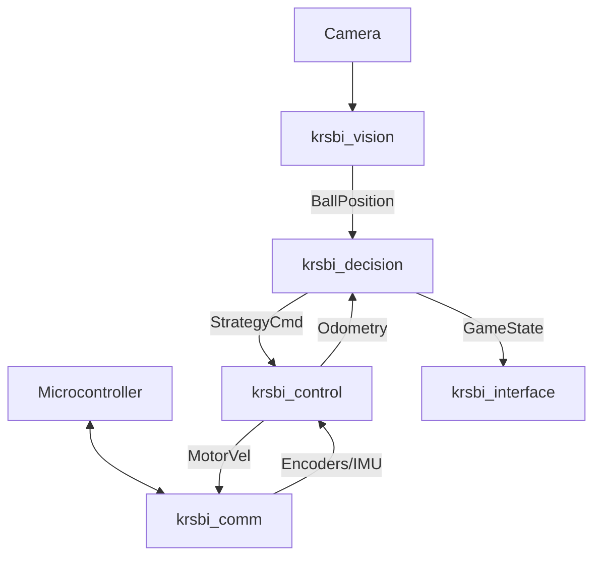

# KRSBI-B Soccer Robot Software

Official software repository for KRSBI-B (Kontes Robot Sepak Bola Indonesia - Beroda) team.
This repository contains the full ROS 2 Jazzy stack for robot autonomy, from low-level control to high-level game strategy.

## 🚀 Features

- **Communication**: Robust serial communication with Arduino/STM32 (`krsbi_comm`) using custom binary protocol.
- **Perception**: Real-time ball detection using YOLOv8 (`krsbi_vision`) and sensor fusion.
- **Control**: 3-Wheel Omni kinematics, odometry localization (IMU + Encoders), and PID motion control (`krsbi_control`).
- **Decision Making**: Advanced behavior tree-based strategy engine (`krsbi_decision`) with dynamic roles (Striker/Goalie).
- **Interface**: GUI for monitoring and parameter tuning (`krsbi_interface`).

## 📦 Package Overview

| Package             | Description                                     | Dependencies                   |
| ------------------- | ----------------------------------------------- | ------------------------------ |
| `krsbi_msgs`        | Custom message definitions (BallPosition, etc.) | std_msgs, geometry_msgs        |
| `krsbi_description` | URDF models and RViz configuration              | xacro, robot_state_publisher   |
| `krsbi_comm`        | Low-level serial communication driver           | krsbi_msgs, serial             |
| `krsbi_vision`      | Computer vision (Ball Detection)                | opencv, ultralytics, cv_bridge |
| `krsbi_control`     | Kinematics, Odometry, Path Planning             | krsbi_comm, tf2_ros, nav_msgs  |
| `krsbi_decision`    | Behavior Tree Strategy & Game Controller        | krsbi_control, py_trees        |
| `krsbi_interface`   | Debugging GUI and Parameter Dashboard           | PyQt5, rclpy                   |

## 🛠️ Quick Start

### 1. Installation

See [Setup Guide](docs/setup_guide.md) for full installation instructions.

```bash
# Clone repository
git clone https://github.com/your-team/krsbi-ros2.git src/krsbi-ros2
cd src/krsbi-ros2

# Install dependencies
rosdep install --from-paths . --ignore-src -r -y
pip install -r requirements.txt

# Build
colcon build --symlink-install
source install/setup.bash
```

### 2. Running the Robot

**A. Full Stack (Autonomy)**

```bash
ros2 launch krsbi_decision decision_bringup.launch.py role:=striker
```

**B. Hardware Only (Drivers)**

```bash
ros2 launch krsbi_comm serial_bringup.launch.py port:=/dev/ttyUSB0
```

**C. Vision Only**

```bash
ros2 launch krsbi_vision vision_bringup.launch.py use_yolo:=true
```

## 🏗️ Architecture



## 📚 Documentation

- [Standard Operating Procedure (SOP)](SOP_MATCH.md)
- [Hardware Wiring Diagram](docs/wiring_diagram.md)
- [Setup & Installation Guide](docs/setup_guide.md)

## 🤝 Contribution

Please follow the coding standards defined in `CONTRIBUTING.md`. Ensure all tests pass before submitting a Pull Request.

## 📄 License

This project is licensed under the MIT License.
